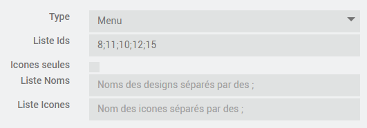

# Plugin Djeesign pour Jeedom

    Ce plugin permet de définir l'aspect visuel ( menu, tuiles et graphes ) des designs.
    Vous voulez en changer, un clic suffit

## 1. Configuration du plugin

    C'est dans la configuration du plugin et donc globalement que l'on choisit le type de visuel qui 
    sera appliqué aux menus et tuiles, les différents visuels correspondent aux fichiers css qui sont placés
    dans Plugins\Djeesign\core\template\dashboard\

    Vous désirez créer votre  propre visuel, il suffit de placer un nouveau fichier css dans ce répertoire 
    pour qu'il soit pris en compte dans la configuration du plugin. Pour que le nom du visuel s'affiche 
    correctement dans la configuration, formatez le nom du fichier css comme suit :
        Djeesign_Argent.css --> Argent sera affiché dans la configuration

## 2. Configuration des équipements

    Le premier choix à effectuer sera de choisir le type d'équipement que l'on désire créer ( menu, tuile ou graphe ).
    N'oubliez pas d'activer l'équipement pour qu'il soit visible sur le design
    Les icones doivent se trouver dans le répertoire data\img\
    
### 2.a. Tuile

        Cet équipement permet la création d'une tuile qui pourra être placé sur un design, on peut définir
        le titre de la tuile ainsi que le nom d'une icone

### 2.b. Menu

        Cet équipement permet la création d'un menu qui pourra être placé sur un design, on peut définir 
        la liste des Ids de design qui seront automatiquement placés dans le menu ainsi qu'une liste de noms 
        d'icones correspondant à ces points de menu.

        Notez que le point de menu correspondant au design affiché est automatiquement sélectionné.       

### 2.c. Graphe

        Cet équipement permet la création d'un graphe minimaliste, on peut spécifier
        deux commandes infos historisées ( par exemple une consigne et la température mesurée ) qui seront
        affichées sur le graphe. Le graphe sera mis à jour automatiquement sur réception des nouvelles valeurs.

